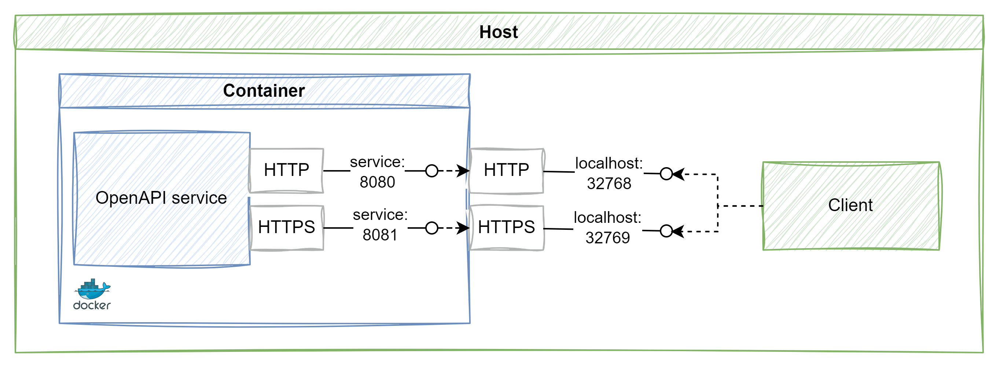
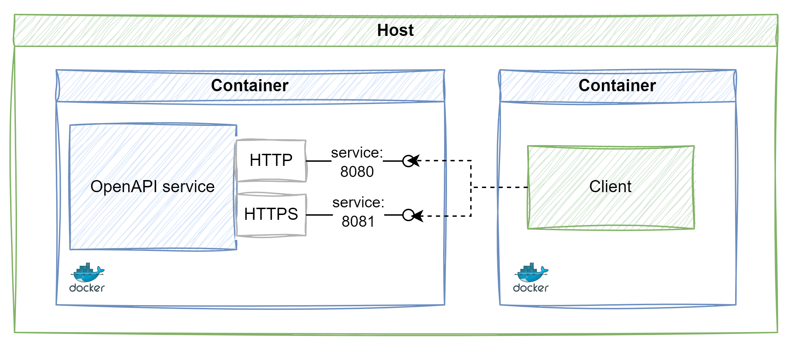

# .NET based service and client in Docker containers using HTTPS

While it is straightforward to host an ASP.NET Core Open API or a .NET based GRPC service in a Docker container,
and the process is well documented (see references below), there is no documentation, or even a blog post that
I could find on how to also host a client in a container and call the services using HTTPS. While in the OpenAPI
case it's possible to disable HTTPS redirection in development, this is not an option for GRPC.

## The problem

The challenge in developing a server and client application using (separate) containers rises from the fact that
during development one uses self-signed certifates as server certificates. ASP.NET Core tooling in Visual Studio
creates and manages these certificates for you (and there is also the `dotnet dev-certs https` tool), but these
are only useful if your client is running on your own computer and not inside a container.

Why does this happen?

When we are running the service in a container, the ports where the service endpoints are exposed are redirected by
Docker to host ports, as in the image. The client, running on the host, uses these ports to access the service endpoints.
The developer certificate generated by ASP.NET Core is available both on the container as a server certificate,
and is installed and trusted on the host, so we can access the HTTPS service endpoint from the client.



As soon as the client moves into a container, we need to use Docker Compose to build the multi-container solution
with all our components, like in the image:



Each component has its own service name in the respective configuration files, and now
the client needs to access the service endpoints using the name of the service. For example, if in `docker-compose.yml`
we have defined our service as below:

```yaml
aspnet-echo-service:
  image: ${DOCKER_REGISTRY-}aspnetechoservice
  build:
    context: .
    dockerfile: aspnet-echo-service/Dockerfile
```
The endpoint that the client needs to use to access the HTTPS endpoint for the Open API, if it is exposed on port 8081,
is `http://aspnet-echo-service:8081`. The self-signed service certificate does not include this name though, so client-
service communication fails.

## The solution


## How to run this sample

Open the solution in Visual Studio.

Before the first build, run the `CreateSelfSignedCertificate.ps1` script. 
This script uses the `New-SelfSignedCertificate` cmdlet to generate a self-signed certificate
that is compatible as an ASP.NET self-signed certificate (see the `TextExtension` properties)
and then export it and copy it into the directories of the services that will use it
(`aspnet-echo-service` as pfx, `grpc-echo-service` as pfx, `test-client` as pem).

`docker-compose.override.yml` sets the Kestrel certificate to the pfx for the two services,
and includes `/app` to `SSL_CERT_PATH` in the client.

Set `docker-compose` as the startup project and run or debug the solution. The file does
not include a healthcheck as a prerequisite to run the client, so it may run before the two 
services are up. You can set a breakpoint in the client to wait for the services to be up.

## References

- [Run an ASP.NET Core app in Docker containers](https://learn.microsoft.com/en-us/aspnet/core/host-and-deploy/docker/building-net-docker-images)
- [ASP.NET Core certificate validation](https://github.com/dotnet/aspnetcore/blob/c4d043dc86e52e8b83f8c0ef3500f2985f90c23c/src/Shared/CertificateGeneration/CertificateManager.cs#L66)
- [Create a self-signed certificate with PowerShell](https://learn.microsoft.com/en-us/powershell/module/pki/new-selfsignedcertificate)
- [Export a .pem file from a certificate in PowerShell](https://craigwilson.blog/post/2024/2024-01-12-export-certs/)
- [Docker compose with HTTPS](https://learn.microsoft.com/en-us/aspnet/core/security/docker-compose-https)
